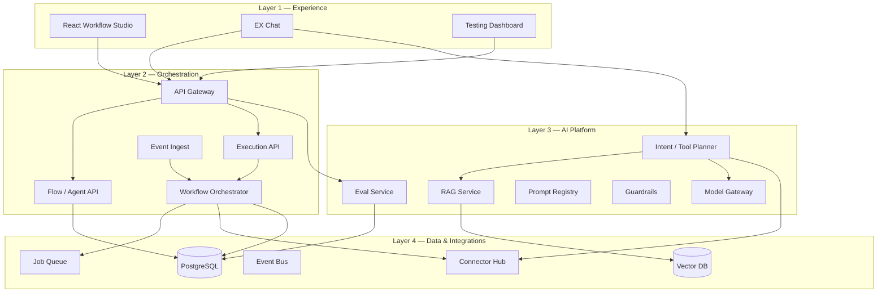

# Workflow Studio — Documentation

**Impact Analytics** · Internal Employee Experience (EX) automation platform  
**Live demo:** [mahip-kakan.github.io/Work-Flow/](https://mahip-kakan.github.io/Work-Flow/)  
**Status:** Phase 0 front-end prototype · Target architecture and rollout documented below

---

## Overview

Workflow Studio is a governed platform for HR and Marketing process automation:

1. **Agent Studio** — low-code composer (trigger → ordered actions)
2. **EX Assistant** — conversational self-service with domain glossaries
3. **Quality platform** — eval suites, drift monitoring, and observability (Testing Dashboard)

The repository ships a React SPA (Phase 0). Backend services, API contracts, and phased rollout are specified in the architecture docs.

---

## Documentation map

### Product

| Document | Description |
|----------|-------------|
| [Vision & scope](./vision-and-scope.md) | Problem statement, personas, goals, success metrics |
| [Product surfaces](./product-surfaces.md) | Screens, roles, verticals, editor model |
| [Product walkthrough](./walkthrough.md) | Guided tour of the live prototype |
| [Roadmap](./roadmap.md) | Phase 0 → Phase 5 delivery plan |

### Flow catalogs

| Document | Description |
|----------|-------------|
| [HR flows](./flows/hr.md) | Onboarding, TA, policy QA, HRIS remediation |
| [Marketing flows](./flows/marketing.md) | Campaign debrief, repurposing, experiments |
| [Appendix — Healthcare & IT/SaaS](./flows/appendix.md) | Additional vertical breadth |

### Architecture

| Document | Description |
|----------|-------------|
| [Architecture overview](./architecture/README.md) | Platform layers, system context, diagrams *(renders on GitHub)* |
| [Backend services](./architecture/backend-services.md) | APIs, orchestrator, AI platform, data stores |
| [Runtime sequences](./architecture/runtime-sequences.md) | End-to-end execution flows *(sequence diagrams)* |
| [Eval & governance](./architecture/eval-and-governance.md) | Quality gates, guardrails, observability |

---

## Architecture at a glance

Diagrams below render directly on GitHub (Mermaid).

### Four-layer platform model



See [architecture overview](./architecture/README.md) for additional diagrams.

---

## Phase 0 vs production

| Capability | Phase 0 (today) | Production target |
|------------|-----------------|-------------------|
| Flow editor & templates | UI + in-memory state | Flow API + Postgres + versioning |
| Activate / test run | UI toggle + mock panel | Orchestrator + connector execution |
| AI chat | Keyword / glossary matching | RAG + LLM + tool planner |
| Testing dashboard | Seeded mock metrics | Eval service + telemetry |
| Integrations | Config panels only | Connector hub (Slack, Teams, HRIS, Jira) |

---

## Repository layout

```
docs/                  ← This documentation
src/                   ← React application
  components/          ← UI surfaces
  data/                ← Vertical catalogs (triggers, actions, templates)
  testing-dashboard/   ← Eval & observability UI
```
