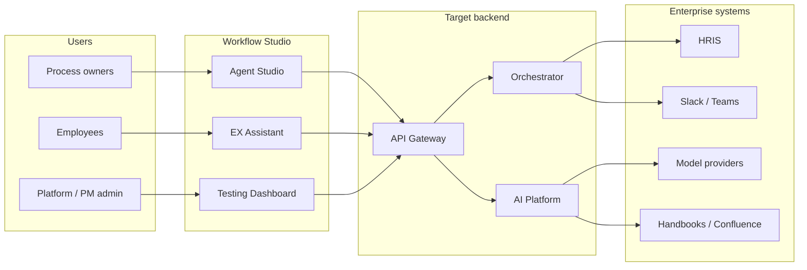
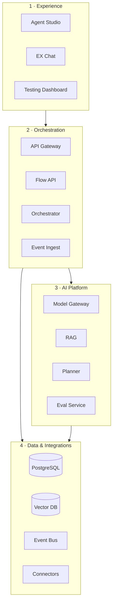
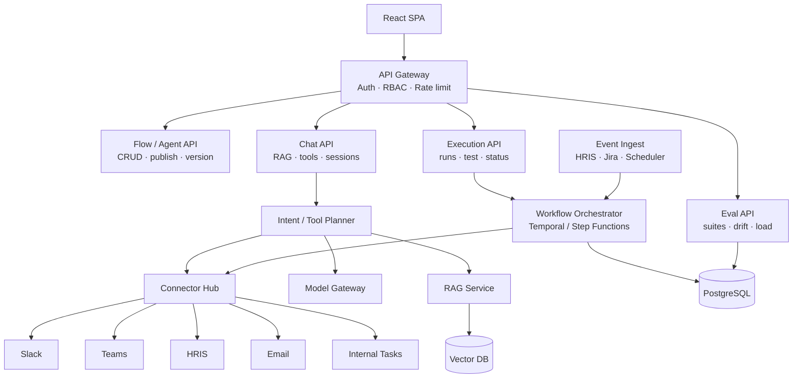
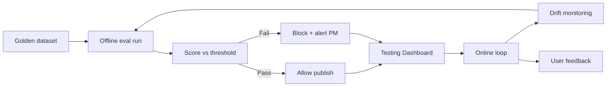

# Architecture Overview

Target production architecture for Workflow Studio — an internal EX automation platform at Impact Analytics.

**Related docs:** [Backend services](./backend-services.md) · [Runtime sequences](./runtime-sequences.md) · [Eval & governance](./eval-and-governance.md)

All diagrams on this page use **Mermaid** and render directly on GitHub.

---

## System context

Workflow Studio sits between process owners (HR, Marketing), employees (self-service), and enterprise systems (HRIS, collaboration, LLM providers).

---

## Four-layer model

| Layer | Responsibility | Key components |
|-------|----------------|----------------|
| **1 · Experience** | Builder UI, employee chat, observability | React SPA, Testing Dashboard |
| **2 · Orchestration** | Flow lifecycle, event matching, execution | Flow API, Orchestrator, Event Ingest, Connector Hub |
| **3 · AI Platform** | Retrieval, planning, models, quality | Model Gateway, RAG, Prompt Registry, Guardrails, Eval Service |
| **4 · Data & Integrations** | Persistence, events, external systems | PostgreSQL, Vector DB, Event Bus, Job Queue, Connectors |

---

## Backend service topology

Detailed API specs: [backend-services.md](./backend-services.md)

---

## AI evaluation pipeline

Publish gate: no flow reaches production without passing offline eval suites.

Full spec: [eval-and-governance.md](./eval-and-governance.md)

---

## Design principles

1. **Async execution** — multi-step runs via job queue; no blocking HTTP chains across connectors  
2. **Versioned flows** — draft → eval gate → publish; production runs pinned versions only  
3. **Permission-aware RAG** — retrieval filtered by employee role and document ACLs  
4. **Human-in-the-loop** — LLM drafts (JD, policy) require approval before external send  
5. **MCP-compatible tools** — connectors expose standardized interfaces for agent planners  
6. **Fail safe** — retries, circuit breakers, graceful degradation, audit on every run  

---

## Phase alignment

| Phase | Architecture milestone |
|-------|------------------------|
| 0 (now) | Front-end prototype only |
| 1 | Flow API + Postgres + sandbox runs |
| 2 | Orchestrator + HRIS webhooks + RAG |
| 3 | Marketing event ingest + LLM tools |
| 4 | Eval service as publish gate + governance console |
| 5 | Slack/Teams employee channels |

See [roadmap](../roadmap.md).
