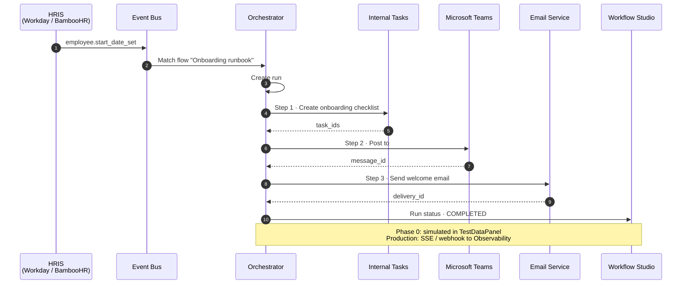
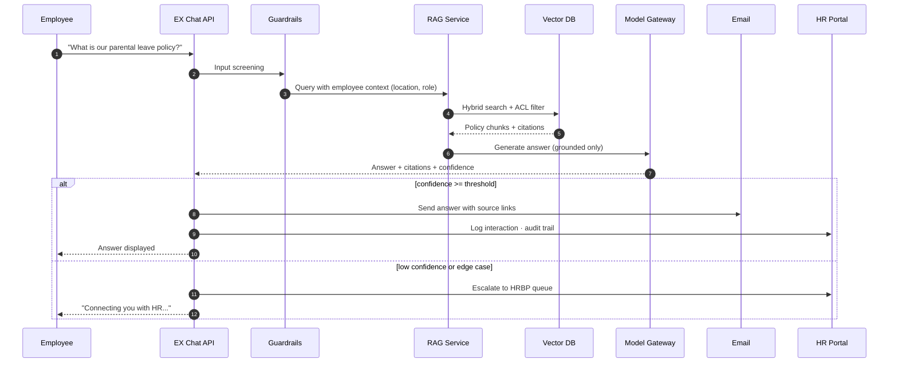
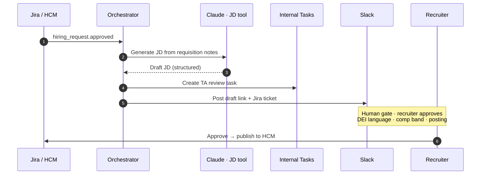
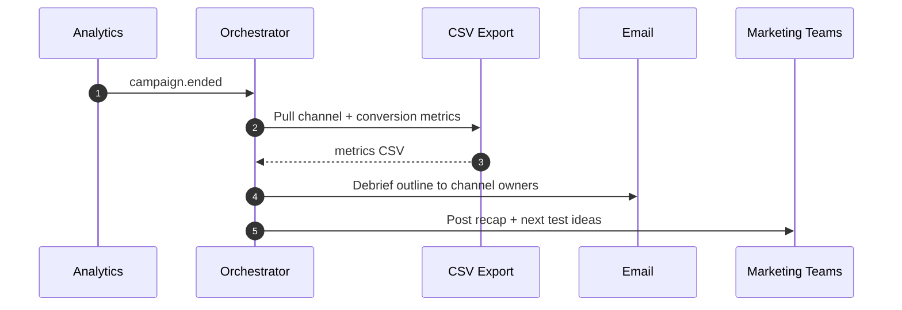
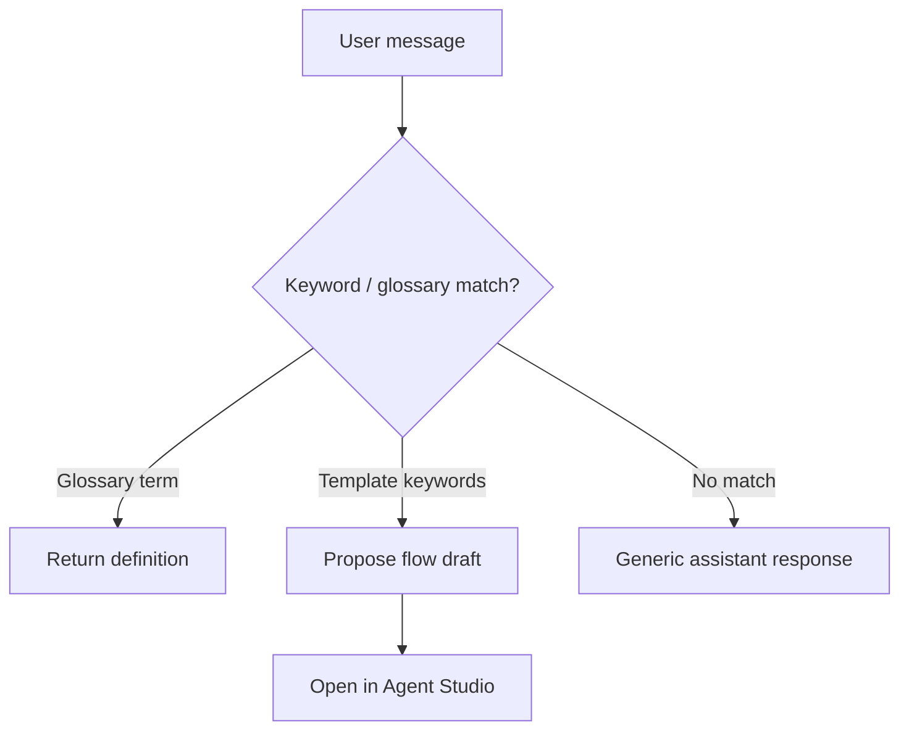
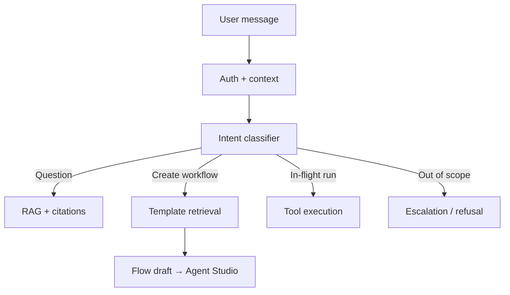
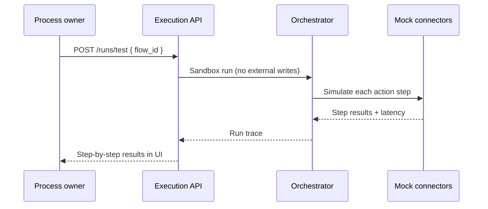

# Runtime Sequences

End-to-end execution flows for Workflow Studio. Diagrams render directly on GitHub (Mermaid).

**Related:** [Backend services](./backend-services.md) · [HR flow catalog](../flows/hr.md)

---

## HR onboarding runbook

**Flow ID:** `hr-1` · **Trigger:** `employee.start_date_set` (HRIS webhook)

When a start date is confirmed in HRIS, the orchestrator executes a linear action pipeline.

### Action pipeline

| Step | Action | Connector |
|------|--------|-----------|
| 1 | Create onboarding checklist (IT, facilities, hiring manager) | `internal_tasks` |
| 2 | Send Teams message to onboarding channel | `microsoft_teams` |
| 3 | Send welcome email (logistics, paperwork) | `email` |

---

## Policy Q&A (EX Assistant)

**Flow ID:** `hr-flow-policy-qa` · **Trigger:** employee policy question

---

## JD generator (human-in-the-loop)

**Flow ID:** `hr-flow-jd-generator` · **Trigger:** hiring request raised

---

## Marketing post-campaign debrief

**Flow ID:** `mkt-post-campaign-debrief` · **Trigger:** campaign ended

See [Marketing flows](../flows/marketing.md).

---

## Chat intent routing (Phase 0 vs production)

### Phase 0 (prototype)

### Production target

---

## Sandbox test run

Phase 1 adds `POST /api/v1/runs/test` — executes pipeline without external side effects.

