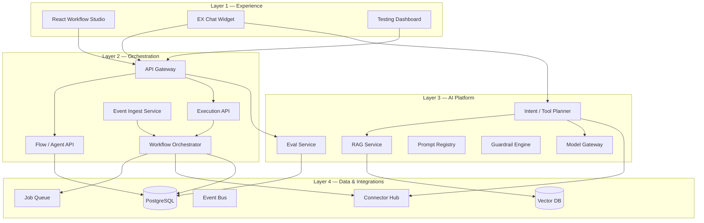

# 06 — Backend Architecture

Target production architecture to productionize the Phase 0 front-end prototype. Designed for enterprise EX: governed, auditable, async, and multi-vertical.

**Diagram:** [diagrams/03-backend-architecture.excalidraw](./diagrams/03-backend-architecture.excalidraw)

---

## Architectural principles

1. **Separation of concerns** — Experience, orchestration, AI, and data are independently scalable layers  
2. **Async by default** — Workflow runs are job-queue backed; no synchronous multi-connector chains in HTTP request path  
3. **Version everything** — Flows, prompts, and eval suites are versioned; production executes published versions only  
4. **Permission-aware retrieval** — RAG respects document ACLs matching the requesting employee  
5. **Fail safe** — Retries, circuit breakers, graceful degradation, and human escalation paths  
6. **MCP-compatible tools** — Connectors expose standardized tool interfaces for agent planners  

---

## Four-layer model



---

## Core services

### API Gateway

- JWT / SSO authentication (Okta, Azure AD)  
- RBAC: builder, employee, pm_admin, platform_admin  
- Rate limiting per tenant and per user  
- Request tracing (`X-Request-ID` → OpenTelemetry)  

### Flow / Agent API

| Method | Path | Purpose |
|--------|------|---------|
| `GET` | `/api/v1/flows` | List flows (filter by vertical, status) |
| `POST` | `/api/v1/flows` | Create draft flow |
| `PUT` | `/api/v1/flows/{id}` | Update draft |
| `POST` | `/api/v1/flows/{id}/publish` | Publish version (runs eval gate) |
| `GET` | `/api/v1/flows/{id}/versions` | Version history |
| `PATCH` | `/api/v1/flows/{id}/activate` | Enable/disable trigger matching |

**Flow schema (published):**

```json
{
  "id": "flow-hr-onboarding-001",
  "org_id": "impact-analytics",
  "vertical": "hr",
  "name": "New hire onboarding runbook",
  "version": 3,
  "status": "published",
  "trigger": {
    "type": "event",
    "source": "hris",
    "event": "employee.start_date_set",
    "filters": { "country": "US" }
  },
  "actions": [
    {
      "type": "create_task",
      "connector": "internal_tasks",
      "config": { "template": "onboarding_checklist_v2" },
      "retry": { "max_attempts": 3, "backoff_ms": 1000 }
    },
    {
      "type": "send_teams",
      "connector": "microsoft_teams",
      "config": { "channel": "onboarding", "template": "new_hire_alert" }
    },
    {
      "type": "send_email",
      "connector": "email",
      "config": { "template": "welcome_v3" }
    }
  ],
  "permissions": {
    "owners": ["hr-ops"],
    "executors": ["system"]
  }
}
```

### Event Ingest Service

Consumes external webhooks and internal scheduler events:

| Source | Example events |
|--------|----------------|
| HRIS (BambooHR, Workday) | `employee.start_date_set`, `offer.accepted`, `lifecycle.change` |
| Jira | `hiring_request.approved` |
| CMS | `content.published` |
| Analytics | `campaign.ended`, `experiment.concluded` |
| Scheduler | `cron.weekly`, `t_minus.start_date` |

**Matching logic:** `(event_type, filters)` → active published flows → enqueue run

### Workflow Orchestrator

Recommended implementation: **Temporal** or **AWS Step Functions**

Per run lifecycle:

```
PENDING → RUNNING → { COMPLETED | FAILED | PARTIAL | CANCELLED }
```

Each action step:

1. Resolve connector + validate config  
2. Execute with idempotency key (`run_id + step_index`)  
3. Persist step result + latency + error payload  
4. Retry transient failures; escalate permanent failures  
5. Emit trace span + audit log entry  

**Sequence diagram (HR onboarding):** [diagrams/02-hr-onboarding-sequence.excalidraw](./diagrams/02-hr-onboarding-sequence.excalidraw)

### Execution API

| Method | Path | Purpose |
|--------|------|---------|
| `POST` | `/api/v1/runs/test` | Sandbox execution (no external side effects) |
| `POST` | `/api/v1/runs` | Manual trigger (admin only) |
| `GET` | `/api/v1/runs/{id}` | Run status + step results |
| `GET` | `/api/v1/runs` | Filter by flow, status, date range |

### Conversational API

| Method | Path | Purpose |
|--------|------|---------|
| `POST` | `/api/v1/chat` | Employee message → structured response |
| `GET` | `/api/v1/chat/sessions/{id}` | Session history |

**Request:**

```json
{
  "message": "What is our parental leave policy?",
  "vertical": "hr",
  "session_id": "sess_abc",
  "user_context": { "employee_id": "E-9912", "location": "US", "role": "employee" }
}
```

**Response types:**

| Type | When | Payload |
|------|------|---------|
| `answer` | RAG hit | `{ text, citations[], confidence }` |
| `flow_proposal` | Intent match | `{ flow_draft, confirm_url }` |
| `tool_result` | Active workflow | `{ step, result }` |
| `escalation` | Low confidence / OOS | `{ handoff: "hrbp_queue" }` |

**Processing pipeline:**

```
Auth → Intent classify → Route:
  ├─ RAG (glossary / handbook)     → Model Gateway + Vector DB
  ├─ Template match (flow create)  → Flow API draft
  ├─ Tool execution (in-flight run) → Orchestrator
  └─ Fallback / escalation         → Guardrail response
```

---

## AI platform services

### Model Gateway

- Multi-model routing (Claude, GPT-4, internal models)  
- Fallback chain on timeout or rate limit  
- Token accounting per team / vertical  
- PII redaction pre-inference  

### RAG Service

- Chunk HR handbook, marketing playbooks, Confluence pages  
- Embed → vector index (pgvector or Pinecone)  
- Hybrid search: BM25 + semantic  
- **Access filter:** only chunks user can read  
- Citation extraction mandatory for policy answers  

### Prompt Registry

- Versioned prompts: `hr-jd-generator-v2`, `mkt-debrief-v1`  
- Environment promotion: dev → staging → prod  
- Linked to eval suites (regression on prompt change)  

### Guardrail Engine

- Out-of-scope detection (clinical advice, legal advice)  
- Prompt injection screening on user input  
- Output validation (citation required, max length, banned phrases)  
- Maps to Testing Dashboard prompt tests  

### Eval Service

See [07 — Eval & Governance](./07-eval-and-governance.md)

---

## Connector hub

Each action type maps to a connector implementing:

```typescript
interface ConnectorAction {
  id: string;
  execute(input: ActionInput, ctx: RunContext): Promise<ActionResult>;
  validate(config: ActionConfig): ValidationResult;
  requiredScopes: string[];
  sandboxMode: boolean;
}
```

| Connector | Actions enabled |
|-----------|-----------------|
| `microsoft_teams` | send_teams |
| `slack` | send-slack |
| `email` | send-email |
| `internal_tasks` | create-care-task-* |
| `hris` | read events, write employee updates |
| `jira` | create/update tickets |
| `llm_tools` | invoke-hr-jd-generator, invoke-hr-policy-qa, etc. |
| `analytics` | export-csv, run-data-quality-check |

**MCP:** External tools registered as MCP servers; gateway whitelists approved servers per org.

---

## Data stores

| Store | Technology | Contents |
|-------|------------|----------|
| Primary DB | PostgreSQL | Flows, versions, runs, steps, users, audit, eval results |
| Vector index | pgvector / Pinecone | Embedded knowledge chunks + metadata ACLs |
| Cache | Redis | Session state, rate limits, idempotency keys |
| Object storage | S3 / GCS | CSV exports, generated docs, eval artifacts |
| Event bus | Kafka / SQS | Webhook events, run triggers |
| Job queue | SQS / Temporal task queue | Async action execution |
| Observability | Datadog / OpenTelemetry | Traces, metrics, logs, token cost |

---

## Security & compliance

| Control | Implementation |
|---------|----------------|
| Authentication | SSO (Okta / Azure AD) |
| Authorization | RBAC + vertical-scoped flow ownership |
| Data isolation | `org_id` on all records; tenant-scoped vector indexes |
| Audit trail | Immutable log: who published, who triggered, what data accessed |
| Encryption | TLS in transit; AES-256 at rest |
| Human-in-the-loop | LLM outputs requiring approval before external send (JD, policy) |

---

## Non-functional targets

| Metric | Target |
|--------|--------|
| Chat p95 latency | < 2s (RAG path) |
| Orchestrator step p95 | < 5s per connector (excl. LLM) |
| Availability | 99.9% API uptime |
| Eval gate | 100% of publishes run offline suite |
| Recovery | Failed steps retry 3x; DLQ for manual replay |

---

## Front-end → API migration map

| Current (Phase 0) | Production API |
|-------------------|----------------|
| `useState(savedFlows)` | `GET/POST /api/v1/flows` |
| `handleActivateFlow()` | `PATCH /api/v1/flows/{id}/activate` |
| `TestDataPanel` mock | `POST /api/v1/runs/test` |
| `AIChatPanel` keyword match | `POST /api/v1/chat` |
| Testing Dashboard seeds | `GET /api/v1/evals`, `/drift`, `/load` |
