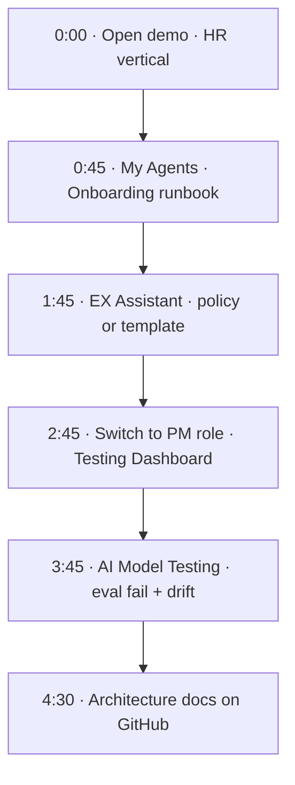

# Product Walkthrough

Guided tour of the Workflow Studio prototype (≈5 minutes).  
**Live URL:** [mahip-kakan.github.io/Work-Flow/](https://mahip-kakan.github.io/Work-Flow/)

**Related:** [HR flows](./flows/hr.md) · [Architecture overview](./architecture/README.md)

---

## Before you start

- Open the demo in a modern browser  
- Set vertical to **HR** (header dropdown)  
- Set role to **Developer** (to begin in builder mode)  

---

## 1 · Home & navigation (0:00)

Load the demo and select **HR** in the header.

The sidebar provides access to:

- **Home** — featured templates and quick-create  
- **Discover** — browse by category and product module  
- **My Agents** — saved flows for the active vertical  
- **Glossary** — HR terminology  

Workflow Studio is an internal EX automation platform at Impact Analytics. Phase 0 is a front-end prototype; backend architecture and eval framework are documented under [`docs/architecture/`](./architecture/README.md).

---

## 2 · Flow editor (0:45)

**My Agents** → **New hire onboarding runbook**

Walk through the canvas:

| Step | Component | Description |
|------|-----------|-------------|
| Starter | When start date is set | HRIS event trigger |
| Action 1 | Create onboarding checklist | Tasks for IT, facilities, hiring manager |
| Action 2 | Send Teams message | Notify `#onboarding` channel |
| Action 3 | Send welcome email | First-day logistics and paperwork |

Click the trigger or an action node to open configuration panels.

Production executes this pipeline through an async orchestrator with retries and audit logs — see [HR onboarding sequence](./architecture/runtime-sequences.md#hr-onboarding-runbook).

---

## 3 · EX Assistant (1:45)

Open the chat panel (bottom-right bubble).

Example prompts:

- *"What is a requisition?"* → glossary answer  
- *"Create onboarding workflow when start date is set"* → template proposal  

Phase 0 uses keyword and glossary matching. Production replaces this with RAG over the HR handbook plus an intent planner — see [runtime sequences](./architecture/runtime-sequences.md#chat-intent-routing-phase-0-vs-production).

---

## 4 · Testing Dashboard (2:45)

Switch header role from **Developer** to **PM**.

The app opens the **Testing Dashboard** — the quality and observability layer for platform admins.

Screens:

- **AI Model Testing** — eval suites and prompt regression  
- **Observability** — drift checks and run traces  
- **Load & Performance** — concurrent chat and routing scenarios  

---

## 5 · Eval results (3:45)

On **AI Model Testing** (HR vertical):

| Suite | Score | Threshold | Status |
|-------|-------|-----------|--------|
| HR glossary accuracy | 94% | ≥ 92% | Pass |
| HR template routing | 91% | ≥ 88% | Pass |
| TA handoff prompts (v1) | 86% | ≥ 90% | **Fail** |

The failing suite demonstrates the publish gate: a prompt version below threshold would block production deployment.

On **Observability**, note the drift check: fallback rate 14% → 19% = **Review**.

Full spec: [Eval & governance](./architecture/eval-and-governance.md).

---

## 6 · Architecture reference (4:30)

Documentation hub: [docs/README.md](./README.md)

Key architecture pages (diagrams render on GitHub):

- [Architecture overview](./architecture/README.md) — four-layer model, service topology  
- [Backend services](./architecture/backend-services.md) — APIs, orchestrator, connectors  
- [Runtime sequences](./architecture/runtime-sequences.md) — execution flow diagrams  
- [Roadmap](./roadmap.md) — Phase 0 → Phase 5  

---

## Alternate paths

| Interest | Path |
|----------|------|
| Marketing flows | Switch vertical → Discover → Post-campaign debrief |
| AI governance | Switch to IT/SaaS → AI Surfaces |
| Healthcare vertical | See [appendix](./flows/appendix.md) |
| What's not built yet | [docs/README.md — Phase 0 vs production](./README.md#phase-0-vs-production) |

---

## Walkthrough flow (diagram)

